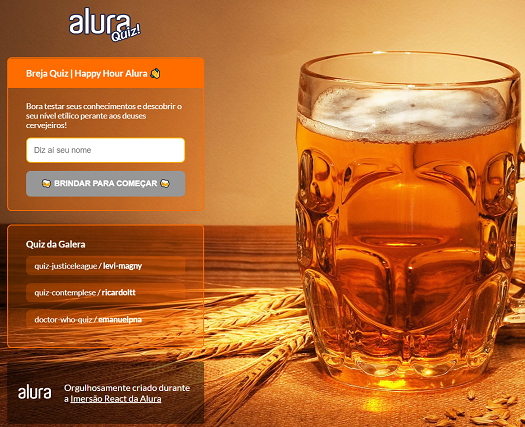

# bitter-brewing-quiz :beer:
Quiz App based on Next js

_Do you like beer? A real in the jar for each wrong answer._



## Summary

- [Templates](#templates)
  - [Style Components Template](#style-components-template)
  - [Material-UI](#material-ui)
  - [Creating a Project](#starting-a-project)

- [Coding](#coding)
  - [Start the project](#start-the-project)
  - [Deploy](#deploy)

- [Animations](#animations)
  - [Install](#install)
- [Useful links](#useful-links)
- [Know more about `next.js`](https://nextjs.org/)

## Templates

Templates by `Vercel` are available at https://github.com/vercel/next.js/


#### create project with `styled-components` template

```
$ yarn create next-app --example with-styled-components with-styled-components-app
```

_see more at [Styled Components](https://styled-components.com/)_


#### Material UI
- React components for faster and easier web development.<br />
  https://material-ui.com/

- color pallete customization <br />
  https://material-ui.com/customization/color/#playground


## Coding

from very very very slim to strong mucle `next.js`.


#### Start the project

```
$ yarn dev
```


#### Deploy

Access https://vercel.com/, and signup with `GitHub`.

Connect your account with in order to have all repositories sync with `Versel`.

Choose your `next.js` project, and hit deploy. **done**, pretty tough uhn?


## Animations

see more at [Framer Motion - ready motion libraries for React](https://www.framer.com/motion/)


#### Install

```
yarn add framer-motion
```


## Useful links

[Server Side Rendering](https://nextjs.org/docs/basic-features/data-fetching#getserversideprops-server-side-rendering)
